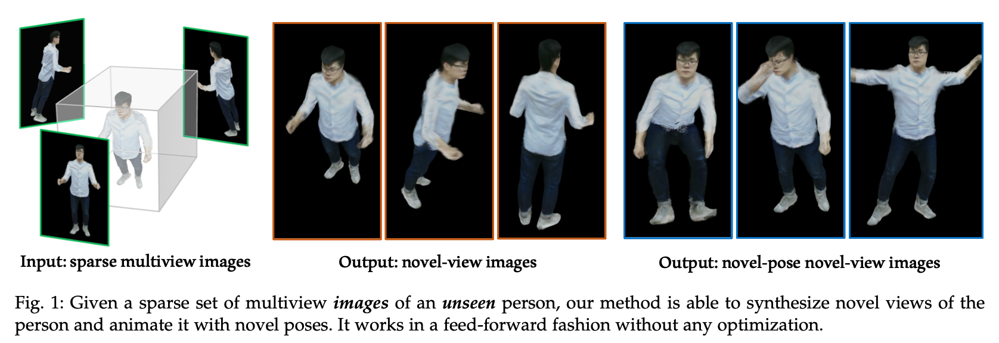
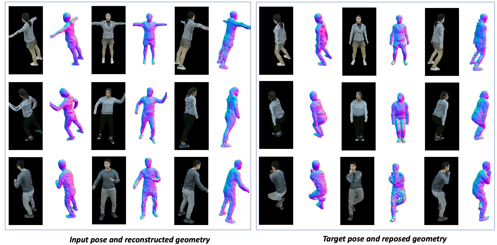

## MPS-NeRF: Generalizable 3D Human Rendering from Multiview Images (TPAMI 2022)
<!-- --- -->
[](https://arxiv.org/abs/2203.16875)

This repository contains the official PyTorch implementation of the TPAMI 2022 paper:

**MPS-NeRF: Generalizable 3D Human Rendering from Multiview Images** <br>
Xiangjun Gao, Jiaolong Yang, Jongyoo Kim, Sida Peng, Zicheng Liu, and Xin Tong <br>[Paper](https://arxiv.org/pdf/2203.16875.pdf) | [Project website](https://gaoxiangjun.github.io/mps_nerf/) | [Video](https://drive.google.com/file/d/1qrAChRD4gUk0eiocnte4vzC3q4GqD_-1/view?usp=sharing) 



> **Abstract** — There has been rapid progress recently on 3D human rendering, including novel view synthesis and pose animation, based on the advances of neural radiance fields (NeRF). However, most existing methods focus on person-specific training and their training typically requires multi-view videos. This paper deals with a new challenging task – rendering novel views and novel poses for a person unseen in training, using only multiview still images as input without videos. For this task, we propose a simple yet surprisingly effective method to train a generalizable NeRF with multiview images as conditional input. The key ingredient is a dedicated representation combining a canonical NeRF and a volume deformation scheme. Using a canonical space enables our method to learn shared properties of human and easily generalize to different people. Volume deformation is used to connect the canonical space with input and target images and query image features for radiance and density prediction. We leverage the parametric 3D human model fitted on the input images to derive the deformation, which works quite well in practice when combined with our canonical NeRF. The experiments on both real and synthetic data with the novel view synthesis and pose animation tasks collectively demonstrate the efficacy of our method.


## Installation
<!-- --- -->
- The code has been tested with python 3.7 + CUDA 11.1. + torch 1.8.1 on Ubuntu 18.04

- In the folder of this repository, run the following commands to install dependencies:

  ```bash
  pip install -r requirements.txt
  ```

- Install the **Pytorch3D** package (guidance from [here](https://github.com/facebookresearch/pytorch3d/blob/main/INSTALL.md)). 


## Set up Dataset
<!-- --- -->

#### THuman Dataset

For generalizable NeRF training, we render multi-view images from THuman dataset, which is a 3D Human Dataset with both geometry and texture.

THuman dataset is released in [DeepHuman](http://www.liuyebin.com/deephuman/deephuman.html) by TsingHua University. We are not allowed to publish or distribute the dataset in any form to any third party without Tsinghua University’s prior written permission.

If you want to use the rendered images from THuman dataset, you may check this download [Instruction](https://github.com/ZhengZerong/DeepHuman/tree/master/THUmanDataset#download-instructions) of THuman dataset. Please fill in the application form and get permission from Prof. [Yebin Liu' Group](http://www.liuyebin.com/index.html). Then you may send me[(xiangjun_gao@outlook.com)](mailto:xiangjun_gao@outlook.com) an email with the agreement as an attachment or just forward their reply email to me. I will share with you the download link of our Thuman training set rendered from the THuman dataset.

#### Human3.6M dataset

Since the license of Human3.6M dataset does not allow us to distribute its data and the dataset is further processed by [animatable_nerf](https://github.com/zju3dv/animatable_nerf), we cannot release the Human3.6M dataset publicly. 
please refer to this [page](https://github.com/zju3dv/animatable_nerf/blob/master/INSTALL.md) to get access to Human3.6M dataset.


```Bash
cd data
ln -s /path/to/THuman THuman
ln -s /path/to/h36m h36m
```

## Train MPS-NeRF
<!-- --- -->

### Training demo with THuman dataset

```bash
CUDA_VISIBLE_DEVICES=0,1 python3 run_nerf_batch.py --config configs/canonical_transformer.txt --view_num 3 --data_root  ./data/THuman/nerf_data_/results_gyx_20181013_hyd_1_M --expname THuman_3_view
```

### Training demo with H36M dataset

### For S1
```bash
CUDA_VISIBLE_DEVICES=0,1  python3 run_nerf_batch.py --config configs/h36m.txt --view_num 3 --test_persons 0 --data_root ./data/h36m/S1/Posing --expname H36M_S1
```

### For S5
```bash
CUDA_VISIBLE_DEVICES=0,1  python3 run_nerf_batch.py --config configs/h36m.txt --view_num 3 --test_persons 1 --data_root ./data/h36m/S5/Posing --expname H36M_S5
```

The training will start! The evaluation will be done automatically once the training is finished.

The code will save the loss curves and evaluation results under `logs/expname`.

The SMPL body related files (including all `.pkl` files under the `assets/` folder) are subject to the license of the [SMPL model](https://smpl.is.tue.mpg.de/). You should download the smpl basic model from this [link](https://drive.google.com/drive/folders/1XnYGE7O1ZO8n2fCmyPwIoscngWzyUlHE?usp=sharing) and move it to the `assets/` folder.


## Extract and Repose Human 3D Shape 
<!-- --- -->



To extract and repose the 3D shape using the density field from sparse input views, you may run the following command.

```bash
python3 extract_thuman_mesh.py --config configs/canonical_transformer.txt --view_num 3 --expname THuman_3_view --use_os_env 1
```

To render the normal map of extracted mesh,

```bash
python3 render_thuman_mesh.py --config configs/canonical_transformer.txt --view_num 3 --expname THuman_3_view
```


## Citations
<!-- --- -->

If you find the codes of this work or the associated ReSynth dataset helpful to your research, please consider citing:

```bibtex
@ARTICLE{9888037,
  author={Gao, Xiangjun and Yang, Jiaolong and Kim, Jongyoo and Peng, Sida and Liu, Zicheng and Tong, Xin},
  journal={IEEE Transactions on Pattern Analysis and Machine Intelligence}, 
  title={MPS-NeRF: Generalizable 3D Human Rendering From Multiview Images}, 
  year={2022},
  volume={},
  number={},
  pages={1-12},
  doi={10.1109/TPAMI.2022.3205910}}
```
<!--
@article{gao2022mps,
  title={MPS-NeRF: Generalizable 3D Human Rendering from Multiview Images},
  author={Gao, Xiangjun and Yang, Jiaolong and Kim, Jongyoo and Peng, Sida and Liu, Zicheng and Tong, Xin},
  journal={arXiv preprint arXiv:2203.16875},
  year={2022}
}
-->

## Recent Research on Generalizable Neural Human Rendering
<!-- --- -->

- [Neural Human Performer: Learning Generalizable Radiance Fields for Human Performance Rendering](https://youngjoongunc.github.io/nhp/)<br>
*Youngjoong Kwon, Dahun Kim, Duygu Ceylan, Henry Fuchs*


- [HumanNeRF: Efficiently Generated Human Radiance Field from Sparse Inputs](https://zhaofuq.github.io/humannerf/)<br>
*Fuqiang Zhao, Wei Yang, Jiakai Zhang, Pei Lin, Yingliang Zhang
Jingyi Yu, Lan Xu*


- [GP-NeRF: Geometry-Guided Progressive NeRF for Generalizable and Efficient Neural Human Rendering](https://arxiv.org/pdf/2112.04312.pdf)<br>
*Mingfei Chen, Jianfeng Zhang, Xiangyu Xu, Lijuan Liu, Yujun Cai, Jiashi Feng, Shuicheng Yan*

- [KeypointNeRF:
Generalizing Image-based Volumetric Avatars
using Relative Spatial Encoding of Keypoints](https://markomih.github.io/KeypointNeRF/)<br>
*Marko Mihajlovic, Aayush Bansal, Michael Zollhoefer, Siyu Tang, Shunsuke Saito*

- [Generalizable Neural Performer: Learning Robust Radiance Fields for Human Novel View Synthesis](https://generalizable-neural-performer.github.io/)<br>
*Wei Cheng, Su Xu, Jingtan Piao, Chen Qian, Wayne Wu, Kwan-Yee Lin, Hongsheng Li*
